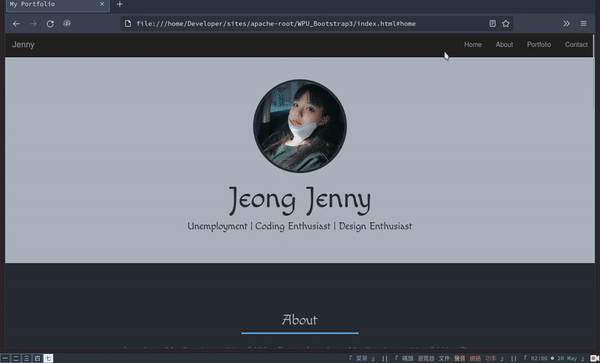

    
    <h3 align="center">Website Portfolio With Boostrap 3</h3>

### Build with

- Html
- Css (New!, include scroll animate smooth)
- Boostrap ver.3 (include Javascript and jquery)
- <del>Javascript (My build)</del> (DEAD/Not used)

---

### View website

  
click for view

  

---

### Getting started

click file "index.html" open via browser

---

### Map files

- [ ] framework
  - [ ] Bootstrap3
    - [ ] css
    - [ ] fonts
    - [ ] js
  - [x] <del>jquery-easing</del>
- [ ] images
  - [ ] portfolio
  - [ ] Profile
- [x] <del>script</del>
- [ ] style

---

### Contact me

hanjina@aol.com

### Thanks for

- [Web Programming UNPAS](https://www.youtube.com/c/WebProgrammingUNPAS)
  - [Tutorial 1](https://www.youtube.com/watch?v=NNW7Tg8CgAQ)
  - [Tutorial 2](https://www.youtube.com/watch?v=btYCEsKJ5k4)
- [Source code](https://github.com/sandhikagalih/NGOBAR)
